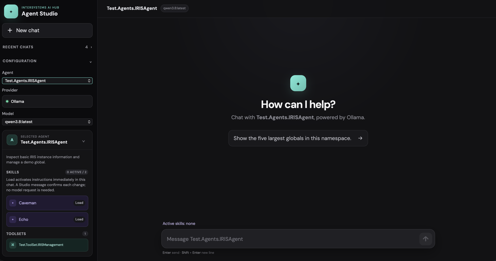
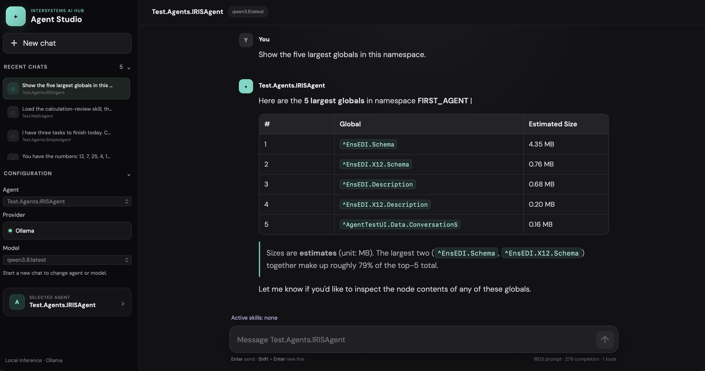
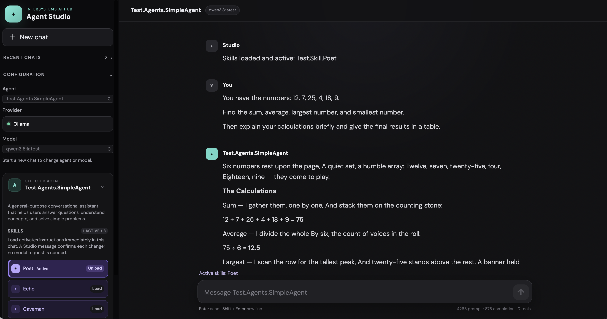
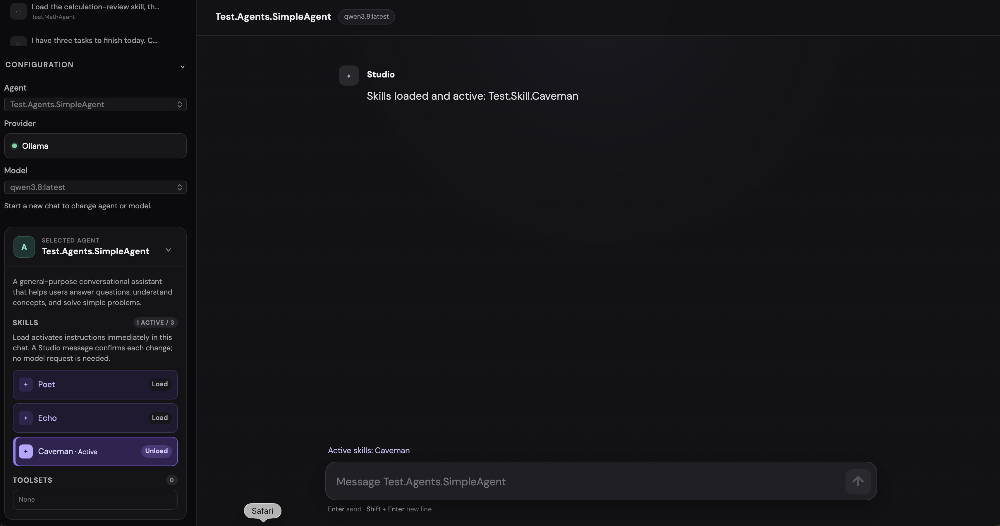
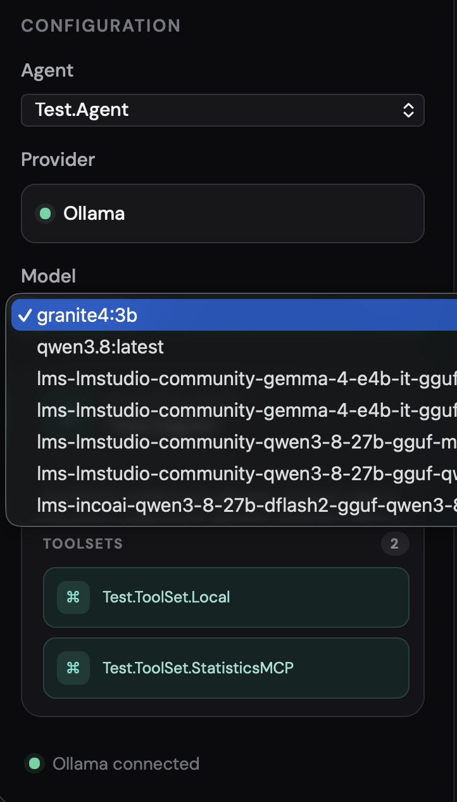

# My First Agent Studio — An IRIS AI Hub Starter & Playground

A hands-on starting point for building and testing native InterSystems
`%AI.Agent` classes with the AI Hub preview, packaged with Docker Compose.
Learn the agent lifecycle in ObjectScript, run guided terminal demos, then
explore the same agents in a browser-based chat workspace.

This is more than a chat UI: the agent classes, tools, skills, sub-agents, and
manual testing examples are part of the project. The browser is another way
to exercise those capabilities, not a replacement for learning the SDK.

It demonstrates:

- agent creation and session management;
- skill activation and usage;
- native IRIS tools and external MCP tools;
- sub-agent delegation patterns;
- terminal demos and a browser-based UI.

This README explains how to run and explore the project. For implementation
details, class relationships, and configuration, see [`dev.md`](dev.md).

This folder contains the IRIS backend, React frontend, Python MCP server,
synthetic dataset, and container configuration. It can be run independently
of the other projects in the parent repository.

More information about this project: [`My First Agent Studio: building and testing native IRIS agents with AI Hub and Ollama`](https://community.intersystems.com/post/my-first-agent-studio-building-and-testing-native-iris-agents-ai-hub-and-ollama)

## Why this project exists

The project brings together a **first-agent tutorial** and a **native agent
playground**. Start with a small arithmetic workflow, move on to synthetic
dataset analysis, and inspect how tools, skills, and delegation affect a
conversation.

The project was built around **Ollama with locally running models** so you
can explore AI Hub features independently, without a paid model API or a
cloud-provider API key. The included examples let you test tools, skills,
external MCP calls, and sub-agent delegation using your own machine. You
still need the AI Hub-enabled IRIS image and a tool-capable model that your
hardware can run; results and performance depend on the model you choose.

The project addresses two complementary ideas from the
[InterSystems Community Bounty Program: “Idea to Application” — Round 2](https://community.intersystems.com/post/community-bounty-program-idea-application-%E2%80%94-round-2-live).

- [My First Agent (End-To-End Starter) (DPI-I-986)](https://ideas.intersystems.com/ideas/DPI-I-986):
  a minimal agent that solves a task using AI Hub features such as skills,
  tools, external MCP servers, and sub-agents, packaged in a Docker Compose
  project. The guided demos and manual terminal sessions provide this
  hands-on starting point.
- [Generic Agent Test UI for %AI.Agent (DPI-I-984)](https://ideas.intersystems.com/ideas/DPI-I-984):
  a browser workspace for selecting an existing native agent and testing
  its own instructions and capabilities without writing a separate frontend
  for it.

| Capability | In this project |
| --- | --- |
| Learn the native SDK | Guided demos and manual ObjectScript sessions show initialization, tools, skills, and sub-agent delegation. |
| Select an existing agent | Discover concrete application subclasses of `%AI.Agent` in `FIRST_AGENT`, without a registration table. |
| Inspect and exercise capabilities | View declared toolsets and skills, load and unload skills immediately, and inspect execution statistics. |
| Try local models | Select an Ollama model while keeping provider configuration in the agent class. |
| Continue conversations | Save SDK sessions and message history in IRIS and reopen them from Recent chats. |

The bundled MCP server demonstrates consuming external tools from an agent;
this project is not the separate MCP Data Exposure Toolkit.

## Choose your starting point

- **First time with AI Hub:** follow [Quick start](#quick-start), then run
  [the basic demo](#test-1-basic-agent-demo).
- **Explore tools and delegation:** run [the patient analysis demo](#test-2-patient-analysis-demo).
- **Write your own prompts in ObjectScript:** use the [manual terminal session](#manual-terminal-session).
- **Try agents visually:** open the [browser UI](#browser-ui).
- **Extend the starter:** see [Add your own agent](#add-your-own-agent).

## Table of contents

- [Why this project exists](#why-this-project-exists)
- [Choose your starting point](#choose-your-starting-point)
- [AI Hub preview and software source](#ai-hub-preview-and-software-source)
- [Quick start](#quick-start)
- [Run the demos](#run-the-demos)
- [Test 1: Basic agent demo](#test-1-basic-agent-demo)
- [Test 2: Patient analysis demo](#test-2-patient-analysis-demo)
- [Manual terminal session](#manual-terminal-session)
- [Browser UI](#browser-ui)
  - [Chat workspace](#chat-workspace)
  - [Choosing between local models](#choosing-between-local-models)
  - [Selecting skills](#selecting-skills)
  - [Storage and troubleshooting](#storage-and-troubleshooting)
- [Add your own agent](#add-your-own-agent)
- [Architecture and verification](#architecture-and-verification)
  - [UI showcase](#ui-showcase)
- [Cleanup](#cleanup)
- [Project structure](#project-structure)
- [Dataset](#dataset)
- [VS Code Tasks](#vs-code-tasks)

## AI Hub preview and software source

Native agent APIs are supplied by the InterSystems AI Hub preview. The
[official AI Hub EAP repository](https://github.com/intersystems-community/ai-hub-eap)
provides documentation and examples; download an AI Hub-enabled IRIS container
image from the [Early Access Program portal](https://evaluation.intersystems.com/Eval/early-access/AIHub).

The included `Dockerfile` expects this base image:

```text
docker.iscinternal.com/docker-intersystems/intersystems/iris-community:2026.3.0AI.136.0
```

Load the downloaded archive before building:

```bash
docker image load -i /path/to/downloaded-iris-ai-hub-image.tar.gz
```

Check that the loaded image name and architecture match the Dockerfile's
`FROM` line. If your EAP download uses a different tag, update that reference
and verify SDK compatibility. Do not assume the internal registry is publicly
accessible or that a standard IRIS image includes these preview APIs.

AI Hub EAP is pre-release software and is not intended for production use.
Consult the [upstream documentation](https://github.com/intersystems-community/ai-hub-eap)
when upgrading; preview APIs and access-control features can change.

---

## Quick start

### Prerequisites

- Docker with Docker Compose;
- an AI Hub-enabled IRIS image loaded locally (see above);
- Ollama running on the host;
- at least one locally installed, tool-capable chat model.

Run the following commands from this folder:

```bash
ollama list
cp .env.example .env
```

Configure `.env`:
```dotenv
OLLAMA_BASE_URL=http://host.docker.internal:11434/v1/
OLLAMA_MODEL=your-installed-model-name
```

Replace the placeholder with an exact model name from `ollama list`. The
Ollama URL must be reachable from inside the IRIS container; adjust it if
Ollama runs on another machine.

Start the backend for the terminal demos:

```bash
docker compose up -d --build --wait --wait-timeout 180 iris
```

Or start the backend and browser UI together:

```bash
docker compose --profile ui up -d --build --wait --wait-timeout 180
```

- [Agent UI](http://localhost:5174) (requires the `ui` profile)
- [IRIS Management Portal](http://localhost:9392/csp/sys/UtilHome.csp?$NAMESPACE=FIRST_AGENT)
- Namespace: `FIRST_AGENT`

The build imports the classes under `src` and runs the dataset setup. You
can also open this folder in VS Code and use **FA - Docker: Build and Start
Agent Only** or **FA - Docker: Build and Start Everything**.

---

## Run the demos

Open an IRIS terminal in the `FIRST_AGENT` namespace:
```bash
docker compose exec iris iris session IRIS -U FIRST_AGENT
```

You can use VS Code task as well to build the backend only or the full project with UI.

---

## Test 1: Basic agent demo

**Command:** `Do ##class(Test.BasicDemo).Run()`

### What it does

```
1. Creates Test.MathAgent
2. Loads the calculation-review skill through a prompt
3. Calls get_mcp_info, an external Python MCP tool
4. Calls add_numbers(17, 25), another external Python MCP tool
5. Delegates verification to the code-defined CalculationReviewer sub-agent
6. Delegates an explanation to a mental-math teacher spawned by the main agent
7. Loads the Caveman skill programmatically through agent.UseSkill
8. Uses the Caveman skill to make the explanation more compact
```

### What you should see

The exact prose and token counts depend on the selected model, but the execution
flow should resemble the following output:

```
Agent: Test.MathAgent
Model: granite4:3b

Available Tools: [Execute, ReviewCalculation, add_numbers, get_mcp_info, ...]

=================================
Prompt>: First load the calculation-review skill...
[agent iteration 1/5]
Token usage: {"completion_tokens":81,"prompt_tokens":1267}
Total tool calls: 2

--- Response: ---
MCP Server: FIRST_AGENT_MCP_7F3A

=================================
Prompt>: Now call add_numbers with first=17 and second=25...
[agent iteration 1/5]
Total tool calls: 4

--- Response: ---
17 + 25 = 42

=================================
Prompt>: Call ReviewCalculation to delegate verification...
[agent iteration 1/5]
[CalculationReviewer] called as tool
Total tool calls: 5

--- Response: ---
Verification: PASS. 17 + 25 = 42 is correct.

=================================
Prompt>: Call Execute to delegate to mental-math teacher...
[agent iteration 1/5]
[Delegation] Creating sub-agent with role 'mental-math teacher'
[Delegation] Sub-agent completed
Total tool calls: 6

<Expect a long output here>

=================================
Prompt>: Using caveman skill, compact the concepts explained from the math teacher
[agent iteration 1/5]
Token usage: {"completion_tokens":20,"prompt_tokens":2099,"total_tokens":2119}
Total tool calls: 6 | Total tool duration (ms): 3078

--- Response: ---
<Expect a very short caveman-like output here>

Parent stats: {"total_tool_calls":6,...}
Spawned sub-agents: 3
+ Calculation reviewer system prompt
+ Mental-math teacher system prompt
```

---

## Test 2: Patient analysis demo

**Command:** `Do ##class(Test.PatientAnalysisDemo).Run()`

### What it does

```
1. Creates Test.Agent
2. Loads the synthetic-healthcare-analysis-brief skill
3. Calls SummarizePatients(diagnosis="Diabetes") -> 115 patients
4. Calls SearchPatients(limit=3) -> P001, P002, P013
5. Calls summarize_measurements for the treatment costs
6. Generates an evidence-bound briefing
7. Delegates the evidence check to the EvidenceReviewer sub-agent
8. Delegates the safety check to the SafetyReviewer sub-agent
9. Delegates the explanation to a Data Analyst sub-agent
```

### What you should see

Output wording may vary by model; the following transcript illustrates the
expected phases and evidence:

#### Phase 1: Primary analysis
```
=================================
Prompt>: Load the synthetic-healthcare-analysis-brief skill...
[agent iteration 1/10]
Total tool calls: 4

--- Parent analysis ---
Synthetic Healthcare Briefing - Diabetes Cohort

SCOPE:
- Dataset: synthetic_healthcare_data.csv
- Filter: Diagnosis = Diabetes
- Rows: 115 patients
- Examples: P001, P002, P013

FINDINGS:
- Average Age: 53.38 years
- Average BMI: 28.84
- Average Treatment Cost: $2,398.24
- Total Treatment Cost: $275,798.10

PATIENT EXAMPLES:
┌─────────┬──────┬──────┬──────────┬────────┬─────────────┐
│ Patient │ Age   │ BMI  │ Cholest. │ Smoker │ Treatment $ │
├─────────┼──────┼──────┼──────────┼────────┼─────────────┤
│ P001    │ 20    │ 24.7 │ 245      │ No     │ 3,328.60    │
│ P002    │ 47    │ 38.5 │ 268      │ Yes    │ 1,041.69    │
│ P013    │ 54    │ 22.9 │ 207      │ Yes    │ 2,548.13    │
└─────────┴──────┴──────┴──────────┴────────┴─────────────┘

COST DISTRIBUTION:
- Mean: $2,306.14
- Median: $2,548.13
- Max: $3,328.60
- Min: $1,041.69

LIMITATIONS:
- Synthetic data, no real-world inference

NEXT ANALYSIS:
- Compare costs above/below mean of $2,306.14
```

#### Phase 2: Evidence review
```
=================================
evidencePrompt>: Call ReviewEvidence to delegate an evidence review...
[agent iteration 1/5]
[EvidenceReviewer] called as tool
Total tool calls: 8

--- Evidence sub-agent ---
Synthetic Healthcare Briefing - Diabetes Cohort
[Reviewed briefing output]
```

#### Phase 3: Safety review
```
=================================
ReviewSafety>: Call ReviewSafety to delegate a safety review...
[agent iteration 1/5]
[SafetyReviewer] called as tool
Total tool calls: 9

--- Safety sub-agent ---
Synthetic Healthcare Briefing - Diabetes Cohort
[Reviewed briefing output]
```

#### Phase 4: Explanation
```
=================================
Prompt>: Call Execute to delegate this task to a sub agent...
[agent iteration 1/5]
[Delegation] Creating sub-agent with role 'data analyst'
[Delegation] Sub-agent created
[Delegation] Sub-agent completed
Total tool calls: 10

--- Generic delegated sub-agent ---
Evidence-Bound Briefing on Synthetic Diabetes Cohort

[Detailed analysis with tables]
[Interpretation]
[Limitations]
[Next steps]
```

#### Phase 5: Execution statistics
```
=================================
Parent stats: {"total_tool_calls":10,"total_interactions":14,...}
Spawned sub-agents: 1

Sub-agent system prompt:
You are a data analyst assistant. Context: [full briefing data]

Active skills: [synthetic-healthcare-analysis-brief]

Available Tools: [Execute, ReviewEvidence, ReviewSafety, SearchPatients, 
                SummarizePatients, add_numbers, summarize_measurements, ...]
```

---

## Manual terminal session

Start a persistent chat session directly from the IRIS terminal. Create and
initialize the agent once; after that, change the value of `prompt` and repeat
the final three commands whenever you want to send another message. Reusing the
same `session` preserves the conversation context between turns.

```objectscript
Set agent=##class(Test.Agent).%New()
Set sc=agent.%Init()
Set session=agent.CreateSession()
Set monitor=##class(Test.DemoMonitor).%New()

Set prompt="What can you safely explain about this synthetic healthcare dataset?"
Set response=agent.Run(session,prompt,10,monitor)
Do ##class(%AI.System).RenderMarkdown(response.Content)
```

Continue the conversation without recreating either the agent or the session:

```objectscript
Set prompt="Your next question here (e.g. How much is the most expensive treatment for smokers vs non smokers?)" 
Set response=agent.Run(session,prompt,10,monitor)
Do ##class(%AI.System).RenderMarkdown(response.Content)
```

You can also activate the bundled Caveman skill and request a more compact
answer:

```objectscript
Set sc=agent.UseSkill("Test.Skill.Caveman")
Set prompt="Using the caveman skill ultra, explain your findings to me."
Set response=agent.Run(session,prompt,10,monitor)
Do ##class(%AI.System).RenderMarkdown(response.Content)
Write session.ActiveSkills.%ToJSON(),!
```

To demonstrate delegation, ask the generic `Execute` tool to create a child
agent for a suitable task:

```objectscript
Set prompt="Call Execute to delegate this task to a data-communication specialist: explain in two short sentences why synthetic data is useful for demonstrations but cannot support clinical conclusions. Use specialistRole='data-communication specialist'."
Set response=agent.Run(session,prompt,10,monitor)
Do ##class(%AI.System).RenderMarkdown(response.Content)
Write agent.SubAgents.Count(),!
```

`UseSkill("Test.Skill.Caveman")` registers the skill as available; it does not
guarantee activation by itself in this SDK preview. The terminal prompt asks
the model to load it. Check `session.ActiveSkills` to verify activation. The
browser UI instead loads and activates skills immediately through an explicit command.

`Execute` follows a different path: it creates a child agent with an isolated
session, runs the delegated request, and returns the child's answer to the
parent as a tool result. `ActiveSkills` and `SubAgents.Count()` provide
structured evidence that the two operations occurred.

`Test.Agent` provides the synthetic healthcare tools and safety instructions,
while the user retains complete control over the value of `prompt`.

---

## Browser UI

Start the complete profile to use the same agents through the browser:

```bash
docker compose --profile ui up -d --build --wait
```

- [Agent UI](http://localhost:5174)
- [IRIS Portal](http://localhost:9392/csp/sys/UtilHome.csp?$NAMESPACE=FIRST_AGENT)

### Chat workspace

- Select an agent and Ollama model in the sidebar. Models are discovered from
  Ollama's `/api/tags`; the configured model is used as a fallback.
- Click the top-left logo to collapse or expand the sidebar. **Recent chats**
  and **Configuration** also collapse independently.
- Expand **Selected agent** to inspect its description, toolsets, and skills.
  Agent details scroll vertically when they exceed the available space.
- Press **Enter** to send or **Shift+Enter** for a new line. The input grows
  with your message up to a viewport-aware limit, then scrolls vertically.
- Agent and model controls are locked once a conversation exists. Use
  **New chat** to change them.
- Responses support Markdown, including GFM tables, code blocks, and KaTeX math. Wide tables
  scroll horizontally. Token and tool-call statistics appear after replies.
- Use **Recent chats** to reopen a conversation, or its delete button to remove
  it after confirmation. **New chat** starts a fresh conversation.

### Choosing between local models

The **Model** dropdown is populated from the models already pulled into your
configured Ollama instance, retrieved through its `/api/tags` endpoint. It
is not a fixed list or a cloud-model catalog: you can test the same agent
with different locally available models without a paid model API.

After pulling another model into that Ollama instance, reload the browser
to refresh the list. Use `ollama list` on the Ollama host to check which
models are installed. If discovery returns no models or Ollama cannot be
reached, the UI falls back to `OLLAMA_MODEL`; this does not download the
model or guarantee that Ollama is available.

Click **New chat**, select the model, and send your first message. The model
is saved when the conversation is created; changing the dropdown does not
switch the model of an existing conversation. To compare models, start a
fresh chat for each one and use the same agent, skills, and prompt. Choose
tool-capable models for the tool and delegation demos; response quality,
tool use, speed, and hardware requirements vary by model.

### Selecting skills

New chats start with no active skills. Click **Load** to load and activate a
skill immediately. The server saves its instructions and adds a **Studio**
confirmation message to the chat; this confirmation is not generated by the
model. No inference request is needed. Changing skills is disabled while a reply runs.

The sidebar shows an active count and an **Active** label; the summary above
the composer repeats the saved selection. Loading before the first message
creates the conversation, so choose your agent and model first.

You can combine skills, switch from one to another, or turn all of them off.
Clicking **Unload** removes its active instructions immediately; it does
not erase earlier messages. Conflicting skill instructions and model behavior
can still affect response quality. After a successful reply, the UI reflects
the session's actual active skills. Reopening a chat restores its saved state,
including skill changes made without sending a prompt.

Caveman uses **ULTRA** instructions whenever active: dense fragments, minimal
filler, and a 3–12-word target for simple answers. No separate “ultra” prompt
is required. This is a style instruction, not a hard output limit; correctness,
required detail, and safety warnings take priority. Model adherence varies.

### Storage and troubleshooting

Chat history and session state are stored in IRIS, not browser storage, so a
page reload does not erase them. The sidebar's collapsed state is stored in
the browser. This Compose setup has no explicitly configured persistent IRIS
data volume: do not rely on history surviving container replacement or removal.
Back up IRIS data before recreating the backend.

The UI shows server error details. If an agent finishes without answer text,
the runtime attempts one text-only completion using the existing conversation
and tool results, without executing tools again. If that also fails, a Studio
notice explains that no final answer was produced. The turn and tool results
are saved in either case: check action outcomes before repeating a request.
This handles missing answer text, not arbitrary provider or tool exceptions.
Legacy null assistant replies
are removed from model context on the next send to prevent the provider error
`invalid message content type: <nil>`; visible chat history is preserved.

This is a local demo with an unauthenticated API and shared chat history, not
a production multi-user service. Do not expose it to untrusted networks.

For API examples, implementation details, and regression checks, see the
[browser UI developer guide](dev.md#browser-ui-development).

---

## Add your own agent

Start with the simple chat agent,
[`Test.Agents.SimpleAgent`](src/Test/Agents/SimpleAgent.cls), for a
general-purpose conversational assistant. It extends `%AI.Agent` directly
and shows how to define instructions, a description, an example prompt,
and an Ollama provider using `OLLAMA_BASE_URL` and `OLLAMA_MODEL`.

Select it in the browser and try: “I have three tasks to finish today. Can
you help me decide which one to do first?” Send a follow-up to explore
conversation context, or enable its Poet, Echo, or Caveman skill to experiment
with response styles. It declares no toolsets, but does register delegation
and reviewer tools during initialization, so it is not a tool-free agent.
When adapting it, keep only the skills and registered tools your agent needs.

For task-specific examples, use
[`Test.MathAgent`](src/Test/Agents/MathAgent.cls) to explore arithmetic with
external MCP tools, or inspect [`Test.Agent`](src/Test/Agents/Agent.cls) for
synthetic healthcare analysis, native IRIS tools, and reviewer registration.

1. Add a non-abstract `%AI.Agent` subclass under `src`, directly or through
   an existing agent base class.
2. Define its instructions and description, configure its provider and model,
   and declare the toolsets and skills it needs. Keep these behaviors in the
   agent class rather than the frontend.
3. Rebuild the backend, or compile the class directly into `FIRST_AGENT`.
   Remember that rebuilding may replace the container; back up data first.
4. Refresh the browser and select the agent. No frontend or REST registration
   change is required. Application classes beginning with `%` are excluded
   from discovery.
5. Test it in the UI or substitute its class name in the manual terminal
   session above. Verify tool results and active skills, not just the prose.

Discovery does not prove that an agent can initialize: missing model or
provider configuration can still prevent a conversation from starting.

## Architecture and verification

Nginx serves the React frontend on port `5174` and forwards `/api/*` to the
IRIS REST application at `/agent-ui/api/*`. IRIS owns agent discovery,
execution, and conversation storage; there is no Node middleware. The
bundled Python MCP server supplies external calculation tools used by the
demos.

With the backend running, execute the SDK regression checks:

```bash
docker compose exec iris iris session IRIS -U FIRST_AGENT '##class(AgentTestUI.Test).Run()'
```

Expected output includes:

```text
PASS: native %AI.Agent discovery
PASS: skill defaults, activation, replacement, unload, restore, validation
PASS: legacy null reply recovery preserves valid history
PASS: immediate skill commands, confirmation, restore, unload, invalid selection
```

These checks exercise discovery and SDK session state without making an LLM
request. They do not verify model responses or the complete browser workflow.
For an end-to-end manual check:

1. Select `Test.MathAgent` and an installed model in the UI. Load its
   calculation-review skill, confirm the Studio notice, then ask: “Call add_numbers with first=17 and
   second=25.” Check the answer and tool-call statistics.
2. Send a follow-up, reload the page, and reopen the conversation from
   **Recent chats**. Confirm that messages and skill selection are restored.
3. Start a new chat with `Test.Agent` and ask it to summarize the synthetic
   Diabetes cohort. Compare the evidence with the patient demo above.
4. In a new SimpleAgent chat, load Poet and confirm activation before sending
   a prompt. Unload it and load Caveman; check the notices and active summary.
   Paste a multiline prompt and check input growth and scrolling.
5. In a new IRISAgent chat, ask for the five largest globals. Check the
   estimated-size table and tool statistics, not the exact pictured values.
6. Run both terminal demos and the manual session to explore skill activation
   and delegation outside the browser.

Model wording, tool choices, and token counts vary. The examples are learning
and testing aids, not exact-output assertions.

### UI showcase

**Starting a chat:** the homepage shows `Test.Agents.IRISAgent`, its example
prompt, declared toolset, and available skills. Recent chats is collapsed.



**IRIS inspection:** the agent answers “Show the five largest globals in this
namespace.” The table contains estimated sizes from the pictured instance,
not fixed expected results. Agent and model controls are locked for this chat.



**Poet in use:** SimpleAgent explains arithmetic with Poet active. The Studio
confirmation records activation separately from the model's response.



**Immediate activation:** Caveman is active; Poet and Echo are not. The Studio
notice confirms the saved change without a model request.



**Local model choice:** the dropdown lists models pulled into the configured
Ollama instance. The pictured names are examples, not required models or a
compatibility guarantee. The provider label is not a live health check.



For class relationships, API examples, and additional checks, see
[`dev.md`](dev.md).

---

## Cleanup

To stop services while retaining the containers:

```bash
docker compose --profile ui stop
```

To remove the complete demo environment, including project volumes and service
images, use the following command. Back up any IRIS data or chat history you
want to retain first:

```bash
docker compose --profile ui down --volumes --remove-orphans --rmi all
```

---

## Project structure

```
my-first-agent/
├── .env.example
├── docker-compose.yml
├── Dockerfile
├── Dockerfile.frontend
├── frontend/          # React UI, Markdown rendering, Nginx API proxy
├── README.md
├── dev.md
├── ARTICLE.md        # Developer Community article
├── pic/              # UI screenshots
├── data/
│   └── synthetic_healthcare_data.csv  # 500 synthetic patients
└── src/
    ├── AgentTestUI/   # REST router, runtime, persistent chats, regression tests
    └── Test/
        ├── Agents/     # Test.Agent, Test.MathAgent, SimpleAgent, IRISAgent
        ├── Data/       # Patient persistence
        ├── Demo/       # BasicDemo, PatientAnalysisDemo, Abstract
        ├── Monitor/    # DemoMonitor
        ├── Setup/      # Installation
        ├── Skill/      # HealthcareAnalysis, CalculationReview, Poet, Echo, Caveman
        ├── SubAgents/  # EvidenceReviewer, SafetyReviewer, CalculationReviewer
        ├── Tools/      # Patients, DelegateTasks
        └── ToolSet/    # Local, StatisticsMCP
```

---

## Dataset

The project imports all 500 synthetic patient records from
[`data/synthetic_healthcare_data.csv`](data/synthetic_healthcare_data.csv)
during container installation. The dataset is derived from the
[Synthetic Healthcare Patient Records Dataset by dnation on Kaggle](https://www.kaggle.com/datasets/dnation/synthetic-healthcare-patient-records-dataset).

Each record contains a patient code, age, gender, BMI, blood pressure,
cholesterol level, smoker and diabetic status, diagnosis, treatment cost,
admission and discharge dates, and outcome. There are no real patient records
or names.

[`Test.Data.Patient`](src/Test/Data/Patient.cls) is the project's patient
persistence class, stored in the `Test_Data.Patient` SQL table. Its importer
separates blood pressure into systolic and diastolic columns and converts
dates and yes/no fields to native IRIS date and boolean types.
[`Test.Setup`](src/Test/Setup/Setup.cls) invokes the importer during installation.

The dataset is intended solely for demonstration and must not be used for
real clinical work.

---

## VS Code Tasks

The workspace includes the following tasks:

1. FA - Docker: Build and Start Agent Only
2. FA - Docker: Build and Start Everything
3. FA - Docker: See Logs
4. FA - Docker: Cleanup Everything
5. FA - Open: IRIS Management Portal
6. FA - Open: Agent UI
7. FA - Run: Basic Demo
8. FA - Run: Patient Analysis Demo
